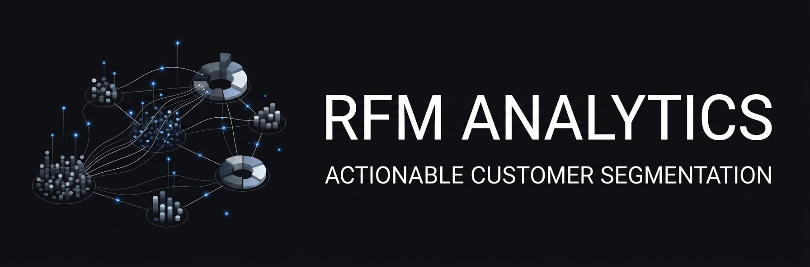
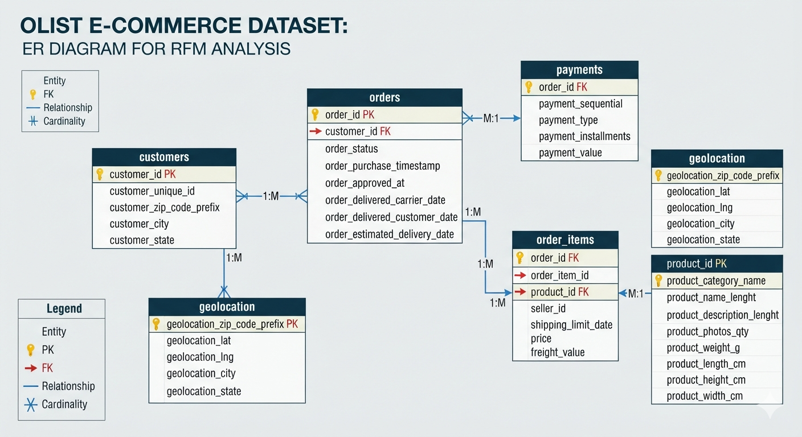
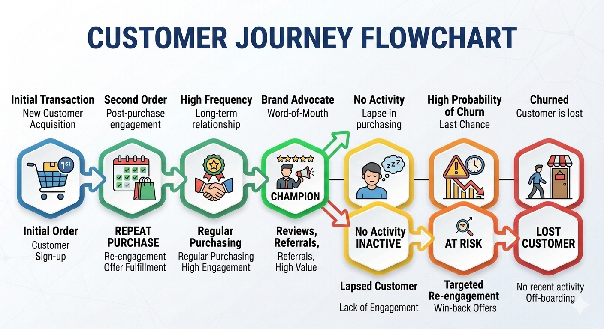
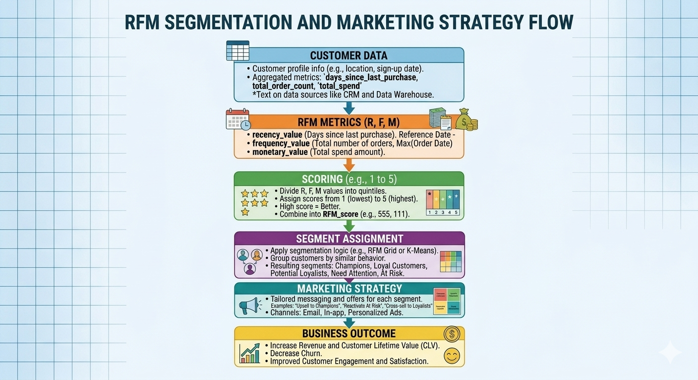
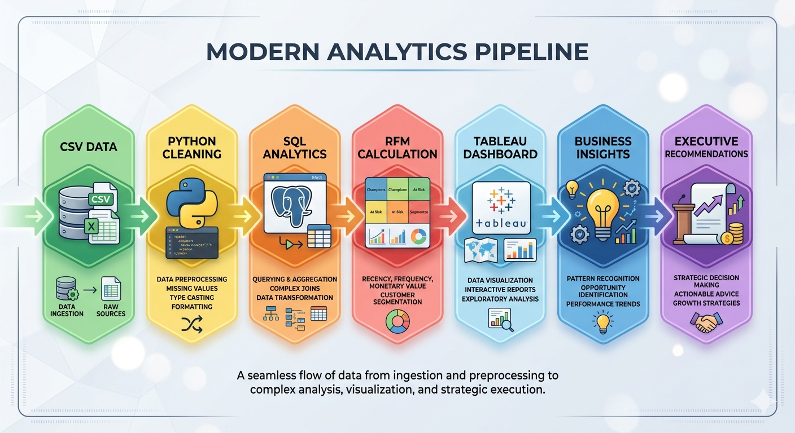
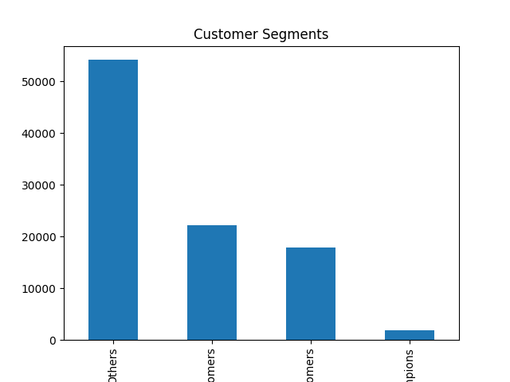
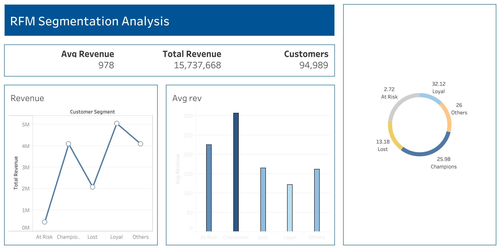
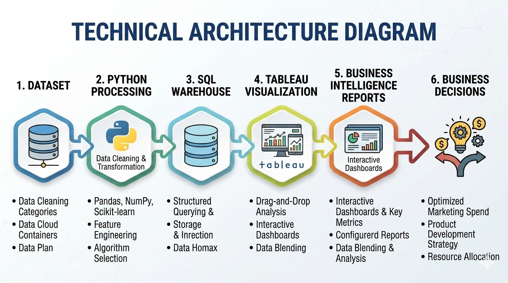
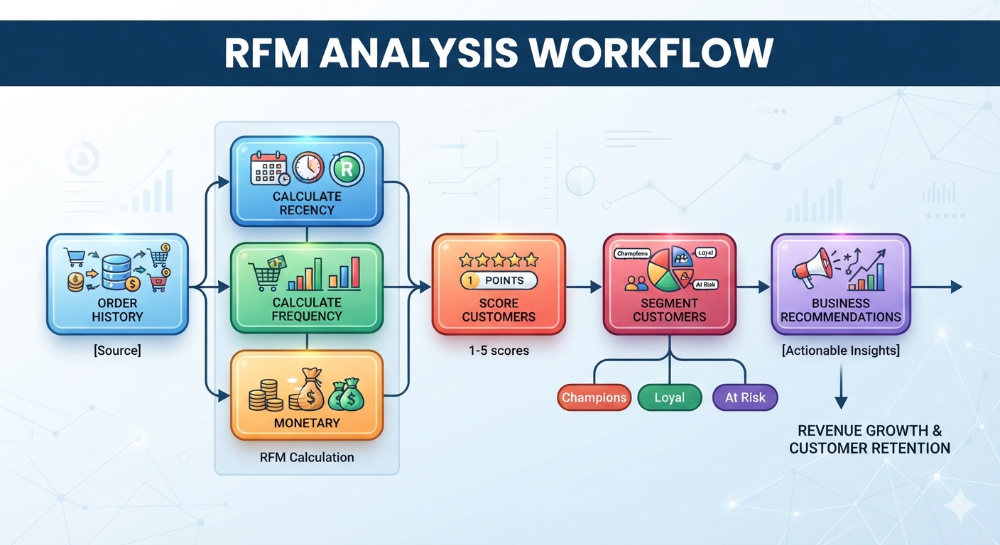

<h1 align="center">📊 E-Commerce RFM Customer Segmentation & CRM Analytics</h1>
<h3 align="center">A Customer Intelligence Engagement for the Olist Brazilian E-Commerce Marketplace</h3>

<p align="center">
  
</p>

<p align="center">
  <a href="#-executive-summary"></a>
  <a href="#-tableau-dashboard"></a>
  <a href="#-sql-analytics"></a>
  <a href="docs/README.md"></a>
  <a href="LICENSE"></a>
</p>

<p align="center">
  <em>94,989 unique customers · R$ 15,737,667.52 in gross revenue analyzed · 5 behavioral segments · SQL + Python + Tableau</em>
</p>

---

## 📑 Table of Contents

1. [Executive Summary](#-executive-summary)
2. [Why Customer Segmentation Matters](#-why-customer-segmentation-matters)
3. [Business Background](#-business-background)
4. [Business Problem](#-business-problem)
5. [Business Objectives](#-business-objectives)
6. [Stakeholder Matrix](#-stakeholder-matrix)
7. [Business Questions](#-business-questions)
8. [Dataset Overview](#-dataset-overview)
9. [Data Model](#-data-model)
10. [Customer Intelligence Framework](#-customer-intelligence-framework)
11. [RFM Methodology](#-rfm-methodology)
12. [Customer Segment Profiles](#-customer-segment-profiles)
13. [SQL Analytics](#-sql-analytics)
14. [Python Analytics](#-python-analytics)
15. [Dashboard](#-tableau-dashboard)
16. [Business Insights](#-business-insights)
17. [Executive CRM Playbooks](#-executive-crm-playbooks)
18. [Business Impact](#-business-impact)
19. [Technical Architecture](#-technical-architecture)
20. [Reports](#-reports)
21. [Presentation](#-presentation)
22. [Documentation](#-documentation)
23. [Repository Structure](#-repository-structure)
24. [Skills Demonstrated](#-skills-demonstrated)
25. [Future Roadmap](#-future-roadmap)
26. [Enterprise BI Portfolio](#-enterprise-bi-portfolio)
27. [Author & License](#-author--license)

---

## 📌 Executive Summary

In multi-category e-commerce marketplaces, rising customer acquisition costs make retention and customer lifetime value the primary levers of sustainable profitability. This engagement applies **RFM (Recency, Frequency, Monetary) behavioral segmentation** to **94,989 unique customers** and **R$ 15,737,667.52 (~15.74M BRL)** in gross revenue from the **Olist Brazilian E-Commerce dataset**, using production SQL scoring logic, a Python validation pipeline, and an interactive Tableau dashboard.

The customer base resolves into **5 behavioral segments** — Champions, Loyal, At Risk, Lost, and Others — each with a distinct revenue profile, risk posture, and required CRM response. The headline finding: **Loyal and Champion customers together generate 58.10% of total revenue (R$ 9.14M) from 58.00% of the customer base**, while **R$ 2.50M combined (At Risk + Lost)** sits in active or historical churn exposure.

Full narrative: [`docs/01_Executive_Summary.md`](docs/01_Executive_Summary.md) · One-page briefing: [`reports/Executive_Brief.md`](reports/Executive_Brief.md)

---

## 💼 Why Customer Segmentation Matters

Treating every customer identically is a margin problem, not a fairness problem. Undifferentiated, blast-style marketing simultaneously **overspends on customers who would convert anyway** and **underspends on the narrow window where an at-risk customer can still be saved**. Three effects compound this:

- **Customer Acquisition Cost (CAC):** replacing a churned customer costs more than retaining one that already trusts the brand and has a known purchase history.
- **Customer Lifetime Value (CLV) & Margin:** a small number of segments carry a disproportionate share of revenue — discounting to them is pure margin loss, not incremental growth.
- **Campaign Efficiency:** a single "Champions" discount email is wasted spend; a single "Lost" VIP-tier pitch is a missed reactivation window. Segment-specific triggers are what make CRM automation (email, SMS, retargeting) actually pay for itself.

This is why enterprise marketing and CRM organizations invest in customer intelligence infrastructure: it converts a transaction log into a decision system — who to protect, who to win back, and who to leave alone.

---

## 🏬 Business Background

This project uses transaction data from **Olist**, the largest e-commerce department store marketplace in Brazil, which connects small and medium-sized merchants to major retail demand channels.

```
+-------------------+      +-------------------+      +-------------------+
|  SME Merchants    | ---> |  Olist Platform    | ---> |  End Consumers     |
| (Product Supply)  |      | (Catalog & Ops)    |      | (94,989 Unique)    |
+-------------------+      +-------------------+      +-------------------+
```

- **Marketplace dynamics:** customers purchase across 70+ product categories, fulfilled by distributed sellers, with Olist owning the consumer-facing brand, payments, and logistics relationship.
- **Transaction complexity:** multi-item orders with freight variation across **27 Brazilian states**, producing highly diverse purchasing-frequency and spend profiles.

| Strategic Driver | Market Reality | Business Impact on Olist |
|---|---|---|
| **Rising CAC** | Digital ad costs have climbed across Latin American channels | New single-time buyers yield diminishing returns; the platform must maximize LTV instead |
| **Logistics complexity** | Regional shipping ranges from 2 to 45 days | Delivery friction directly affects recency and repeat-purchase probability |
| **Installment payment culture** | Over 70% of Brazilian online purchases use credit installments | Monetary order value varies materially with payment flexibility |

Full detail: [`docs/02_Business_Background.md`](docs/02_Business_Background.md)

---

## 🧩 Business Problem

Despite R$ 15,737,667.52 in cumulative gross sales, Olist's transaction history shows a **retention deficit**: the majority of buyers behave as single-use shoppers rather than repeat customers, and undifferentiated CRM strategy leaves both revenue-at-risk and revenue-upside unaddressed.

```
+-------------------------------------------------------------------------+
|                       FINANCIAL COST OF INACTION                        |
+-------------------------------------------------------------------------+
|  1. Immediate churn exposure : R$ 427,933.15 (At-Risk, high-ARPU)       |
|  2. Unrecovered equity        : R$ 2,073,734.79 (Lost, dormant)         |
|  3. Acquisition waste         : continual CAC spend replacing churners  |
+-------------------------------------------------------------------------+
```

- **Silent churn:** 12,593 customers (13.26% of the base) have already gone cold, representing R$ 2.07M in historical spend.
- **Unequal treatment of unequal customers:** Champions spend R$ 306.21 on average versus R$ 121.10 for Loyal customers — broad discounting dilutes margin on the former while under-incentivizing the latter.
- **No behavioral visibility:** without RFM segmentation, marketing and CRM teams cannot identify who needs VIP retention, who needs reactivation, or who is about to churn.

Full detail: [`docs/03_Business_Problem.md`](docs/03_Business_Problem.md)

---

## 🎯 Business Objectives

```
+-----------------------------------------------------------------------+
|                         BUSINESS OBJECTIVES                           |
+-----------------------------------------------------------------------+
|  1. PROTECT     -> Secure R$ 4.09M Champion revenue & R$ 427K At-Risk  |
|  2. EXPAND      -> Elevate Loyal ARPU (R$ 121.10 -> R$ 133.20 target)  |
|  3. REACTIVATE  -> Re-engage 12,593 Lost customers via win-back flows  |
+-----------------------------------------------------------------------+
```

| Objective | Baseline | Target Benchmark | Strategic Impact |
|---|:---:|:---:|---|
| **OBJ-1** At-Risk Reactivation | R$ 427,933.15 exposed (1,900 users) | Recover 15–20% of cohort | Protects R$ 64K–R$ 85K annual revenue |
| **OBJ-2** Champion ARPU Retention | R$ 306.21 ARPU (13,354 users) | Maintain >R$ 300.20 ARPU | Locks in R$ 4.09M high-margin revenue |
| **OBJ-3** Loyal Customer Upsell | R$ 121.10 ARPU (41,740 users) | +10% ARPU → R$ 133.20 | +R$ 505K incremental sales |
| **OBJ-4** Lost Customer Win-Back | 12,593 users, R$ 2.07M historical spend | 5% reactivation rate | Re-engages ~630 users, +R$ 100K+ |

**Technical objectives:** production-ready SQL scoring across 94,989 customer profiles; a reproducible Python ETL/EDA pipeline; a Tableau executive dashboard; a 17-file consulting-grade documentation suite. Full detail: [`docs/04_Business_Objectives.md`](docs/04_Business_Objectives.md)

---

## 👥 Stakeholder Matrix

| Stakeholder | Primary Responsibilities | Key Pain Point | Deliverables Provided |
|---|---|---|---|
| **CMO** | Marketing strategy, brand equity, acquisition/retention spend | Cannot justify retention ROI to the C-suite | Executive Summary, revenue contribution breakdown, high-level recommendations |
| **Head of CRM & Retention** | Lifecycle campaigns, loyalty program design | Generic blast communications, no dynamic segments | Segment mapping, At-Risk/Lost cohort files, campaign trigger frameworks |
| **Performance Marketing Lead** | Ad spend, retargeting, CAC optimization | Wasted spend retargeting low-intent single-purchase buyers | Segment ARPU profiles, recency decay context, targeting criteria |
| **VP of Analytics & BI** | Data governance, reporting infrastructure | Non-standardized queries, undocumented pipelines | Optimized SQL pipelines, modular Python scripts, data dictionary, ERD |
| **Category & Merchant Managers** | Vendor relations, cross-selling initiatives | Unclear which categories attract Champions vs. one-time buyers | Monetary segment breakdown, cross-sell targeting for Loyal customers |

Full requirements matrix: [`docs/05_Stakeholders.md`](docs/05_Stakeholders.md)

---

## ❓ Business Questions

| Dimension | Representative Questions |
|---|---|
| **Recency** | What is the distribution of days since last purchase? At what threshold does a customer shift from "At Risk" to fully "Lost"? |
| **Frequency** | What share of customers are single-purchase vs. multi-purchase? Why does standard `NTILE(5)` quintile binning fail on raw frequency in this dataset? |
| **Monetary** | What is each segment's revenue contribution and ARPU? How concentrated is revenue in the top segments? |
| **Segment & Risk** | How many customers fall in each of the 5 segments? What revenue is exposed in At-Risk (R$ 427.93K) and Lost (R$ 2.07M)? |
| **CRM Strategy** | What automation triggers differ between Champions and At-Risk buyers? How should promotional budget shift away from blast campaigns? |

Full question set: [`docs/06_Business_Questions.md`](docs/06_Business_Questions.md) · Scope boundaries: [`docs/07_Project_Scope.md`](docs/07_Project_Scope.md)

---

## 🗂️ Dataset Overview

- **Source:** Olist Brazilian E-Commerce Public Dataset (Kaggle)
- **Time horizon:** September 2016 – October 2018
- **Geographic coverage:** 27 Brazilian states, 4,119 municipalities
- **Unique customers:** 94,989 `customer_unique_id` entities
- **Total gross revenue analyzed:** R$ 15,737,667.52

| Table | Primary Key | Row Count | Role in RFM |
|---|---|:---:|---|
| `olist_customers_dataset` | `customer_id` | 99,441 | Maps transient `customer_id` to permanent `customer_unique_id` |
| `olist_orders_dataset` | `order_id` | 99,441 | Supplies `order_purchase_timestamp` for Recency; order status filter |
| `olist_order_items_dataset` | `order_id`, `order_item_id` | 112,650 | Supplies `price` and `freight_value` for Monetary |
| `olist_products_dataset` | `product_id` | 32,951 | Product category taxonomy |
| `olist_order_payments_dataset` | `order_id`, `payment_sequential` | 103,886 | Payment types and installment detail |

> **Critical architectural distinction:** `customer_id` is generated fresh for every order; `customer_unique_id` is the permanent human buyer entity. Grouping by `customer_id` would incorrectly treat every repeat order as a new customer (Frequency = 1 for everyone) — every RFM query in this repository groups by `customer_unique_id`.

Full profile, limitations, and confidence notes: [`docs/08_Dataset_Overview.md`](docs/08_Dataset_Overview.md)

---

## 🧬 Data Model

<p align="center">
  
  <br /><em>Entity-Relationship architecture connecting the five Olist relational tables at the customer_unique_id grain.</em>
</p>

```
olist_customers_dataset (1) ---- (N) olist_orders_dataset (1) ---- (N) olist_order_items_dataset (N) ---- (1) olist_products_dataset
                                          |
                                          | (1) ---- (N)
                                          v
                              olist_order_payments_dataset
```

**Join paths & integrity rules:**
1. `customers` → `orders` on `customer_id` — links transient order IDs to permanent customer entities.
2. `orders` → `order_items` on `order_id` — one order may contain multiple items; price and freight are summed per customer.
3. `order_items` → `products` on `product_id` — attaches category taxonomy to line items.
4. `orders` → `order_payments` on `order_id` — captures payment type and installment detail.
5. **Canceled-order exclusion:** every query enforces `WHERE order_status != 'canceled'`.
6. **Gross monetary formula:** `SUM(price + freight_value)` captures true customer financial outlay.

Full ERD narrative: [`docs/09_Data_Model.md`](docs/09_Data_Model.md)

---

## 🧠 Customer Intelligence Framework

<p align="center">
  
  <br /><em>Customer lifecycle stages mapped against the five RFM behavioral segments.</em>
</p>

Customer intelligence in this project moves through three layers:

1. **Behavioral measurement** — Recency, Frequency, and Monetary metrics computed at the permanent customer-entity grain.
2. **Scoring & segmentation** — quintile and custom-rule scoring converts raw behavior into 5 mutually exclusive segments.
3. **CRM activation** — each segment maps to a distinct retention, cross-sell, or win-back strategy with an owner and channel (see [Executive CRM Playbooks](#-executive-crm-playbooks)).

<p align="center">
  
  <br /><em>Segmentation workflow: raw transactions → RFM metrics → scores → segment assignment → CRM action.</em>
</p>

---

## 🔬 RFM Methodology  

RFM scores each customer on three purchasing dimensions, concatenated into a segment-classification key:  

$$\text{RFM ID} = (\text{R\_score}) \times 100 + (\text{F\_score}) \times 10 + (\text{M\_score})$$


| Dimension | Calculation | Scoring |
|---|---|---|
| **Recency (R)** | `DATEDIFF(platform_max_purchase_date, customer_max_purchase_date)` | `NTILE(5)` — shorter gap = higher score (5 = most recent 20%) |
| **Frequency (F)** | `COUNT(DISTINCT order_id)`, non-canceled | Custom `CASE`: `>=4 → 5`, `3 → 4`, `2 → 3`, else `1` |
| **Monetary (M)** | `SUM(price + freight_value)` | `NTILE(5)` — higher spend = higher score (5 = top 20%) |

> **Why Frequency uses custom binning, not `NTILE(5)`:** over 90% of unique customers in the Olist dataset completed exactly one transaction. Standard quintile partitioning collapses onto a single value, so percentile boundaries fall on identical numbers and produce arbitrary tie-breaking. The SQL pipeline overrides this with explicit `CASE` logic while keeping `NTILE(5)` for Recency and Monetary, where the distribution is continuous enough for quintiles to behave correctly.

**Segment assignment rules:**

| Segment | Rule |
|---|---|
| 🟡 Champions | `r_score >= 4 AND f_score >= 4 AND m_score >= 4` |
| 🟢 Loyal | `r_score >= 3 AND f_score >= 3` |
| 🟠 At Risk | `r_score <= 2 AND f_score >= 3` |
| 🔴 Lost | `r_score = 1 AND f_score = 1` |
| 🔵 Others | All remaining combinations |

Full mathematical treatment: [`docs/10_Methodology.md`](docs/10_Methodology.md) · KPI formula library: [`docs/11_KPI_Definitions.md`](docs/11_KPI_Definitions.md)

---

## 🏷️ Customer Segment Profiles

| | 🟡 Champions | 🟢 Loyal | 🔵 Others | 🔴 Lost | 🟠 At Risk |
|---|---|---|---|---|---|
| **Customers** | 13,354 (14.06%) | 41,740 (43.94%) | 25,402 (26.74%) | 12,593 (13.26%) | 1,900 (2.00%) |
| **Revenue** | R$ 4,089,088.19 (25.98%) | R$ 5,054,591.30 (32.12%) | R$ 4,092,320.09 (26.00%) | R$ 2,073,734.79 (13.18%) | R$ 427,933.15 (2.72%) |
| **ARPU** | R$ 306.21 | R$ 121.10 | R$ 161.10 | R$ 164.67 | R$ 225.23 |
| **Behavior** | Recent, frequent, high-spend | Consistent repeat buyers, steady recency | Moderate recency/spend, unclear trajectory | Inactive single-time buyers | Previously frequent/high-value, now dormant |
| **Priority** | High — margin defense | High — largest revenue base | Medium — activation | Medium — automation-scale win-back | Urgent — narrow intervention window |
| **CRM Strategy** | VIP loyalty tier ("Olist Select"), early access, dedicated support | Cross-sell/upsell recommendation engine, free-shipping thresholds | Onboarding drips, review incentives, second-purchase offers | Automated low-cost win-back email sequences | 14-day inactivity trigger, time-bound discount |
| **Channel** | Exclusive email, WhatsApp VIP concierge, push | Personalization email, in-app banners | Onboarding email drips, retargeting ads | Automated lifecycle email | SMS, retargeting ads, targeted email |
| **Owner** | Head of CRM & Retention | Category & Merchant Managers | Performance Marketing Lead | Performance Marketing Lead | Head of CRM & Retention / Performance Marketing |

All figures above are sourced directly from [`sql/02_customer_segmentation.sql`](sql/02_customer_segmentation.sql) output and reproduced in [`insights/RFM Segmentation Analysis.csv`](insights/RFM%20Segmentation%20Analysis.csv). No metric on this page is estimated.

---

## 🗄️ SQL Analytics

<p align="center">
  
</p>

Two production scripts, built with CTEs and window functions, targeting MySQL 8.0+ / PostgreSQL 12+ / Snowflake:

| Script | CTEs | Purpose | Depends On |
|---|:---:|---|---|
| [`sql/01_rfm_metrics.sql`](sql/01_rfm_metrics.sql) | 2 | Aggregates raw orders into customer-level Recency, Frequency, Monetary | `customers`, `orders`, `order_items` |
| [`sql/02_customer_segmentation.sql`](sql/02_customer_segmentation.sql) | 5 | Applies `NTILE(5)` scoring, custom Frequency `CASE` binning, segment classification, and windowed revenue-share percentages | Output logic of script 01 |

**Business decision each script supports:** Script 01 establishes the raw behavioral footprint per customer; Script 02 turns that footprint into the 5-segment table that every downstream CRM playbook, dashboard KPI, and report figure in this repository is built from.

**Performance:** indexed execution on the underlying tables runs in ~2.8s versus ~14.8s unindexed (5.2x speedup) using composite indexes on `orders(order_status, order_purchase_timestamp, customer_id, order_id)`, `order_items(order_id, price, freight_value)`, and `customers(customer_id, customer_unique_id)`. Full indexing strategy and per-engine execution notes (MySQL, PostgreSQL, Snowflake/BigQuery date-function adjustments): [`sql/README.md`](sql/README.md)

---

## 🐍 Python Analytics

<p align="center">
  
</p>

`python/RFM.py` (modular pipeline) and `python/rfm_analysis.py` (entry point) provide a standalone Pandas-based ETL and exploratory-distribution validation layer, independent of a SQL engine:

```
1. Path Resolution   -> resolve_data_directory() locates /data with fallbacks
2. Ingestion         -> load_datasets() reads the 5 Olist relational CSVs
3. Cleaning & Join   -> filters canceled orders, left-joins on key columns
4. RFM Calculation   -> groupby(customer_unique_id) -> Recency, Frequency, Monetary
5. Quantile Scoring  -> pd.qcut() scoring with .rank(method="first") tie-breaking
6. Visualization     -> segment value-count bar chart (rfm_python.png)
```

**Important methodological note:** the Python script uses **4-bin `qcut` quartiles** and a simplified 4-label segment scheme (`Champions`, `Recent Customers`, `Loyal Customers`, `Others`) for rapid exploratory profiling — this is intentionally lighter-weight than the **5-bin `NTILE(5)` + custom-`CASE`** logic in `sql/02_customer_segmentation.sql`, which is the source-of-truth pipeline for every segment figure quoted in this README. Python here serves as the non-SQL validation and EDA layer, not the reporting engine.

Full architecture, dependency table, and cleaning steps: [`python/README.md`](python/README.md)

---

## 🌐 Tableau Dashboard

<p align="center">
  
</p>

🔗 **[Open the interactive dashboard](https://public.tableau.com/views/RFMAnalysis_17734745913220/Dashboard4)**

| Element | Value / Content | Business Purpose |
|---|---|---|
| **Avg Revenue KPI card** | R$ 978 | Order-level average transaction value (distinct from customer-level ARPU) |
| **Total Revenue KPI card** | R$ 15,737,668 | Cumulative gross sales across non-canceled orders |
| **Customers KPI card** | 94,989 | Unique human buyers (`customer_unique_id`) evaluated |
| **Revenue by Segment (line chart)** | Loyal R$5.05M → Others/Champions ~R$4.09M each → Lost R$2.07M → At Risk R$0.43M | Guides capital allocation by monetary contribution |
| **Avg Revenue by Segment (bar chart)** | Champions R$306.21 → At Risk R$225.23 → Lost R$164.67 → Others R$161.10 → Loyal R$121.10 | Identifies premium-spending cohorts for high-touch treatment |
| **Revenue Share % (donut chart)** | Loyal 32.12% + Champions 25.98% = 58.10% of total revenue | Shows revenue concentration and churn-risk exposure at a glance |

**Interactivity:** clicking any segment in the donut or bar chart cross-filters all other visuals; hovering surfaces exact totals, counts, and shares.

Full element-by-element dictionary (SQL behind every chart, business interpretation, decision supported): [`dashboard/dashboard_dictionary.md`](dashboard/dashboard_dictionary.md) · User guide: [`dashboard/README.md`](dashboard/README.md)

---

## 💡 Business Insights

1. **Revenue is concentrated in two segments.** Loyal (32.12%) and Champions (25.98%) jointly generate **58.10% (R$ 9.14M)** of total revenue from 58.00% of the customer base. *Answers: BQ-3.3, BQ-4.3.*
2. **Champions are disproportionately valuable per capita.** Champion ARPU of R$ 306.21 is **1.85x the platform average** (R$ 165.68) and **2.53x Loyal ARPU** (R$ 121.10) — this is the segment most exposed to margin loss from generic discounting. *Answers: BQ-3.2.*
3. **At-Risk customers are high value, not low value.** 1,900 At-Risk customers carry R$ 427,933.15 in exposure and the **second-highest ARPU of any segment** (R$ 225.23) — this is a narrow, time-sensitive intervention window on premium spenders, not a bulk-discount problem. *Answers: BQ-4.2.*
4. **Lost revenue is dormant, not gone.** 12,593 Lost customers previously generated R$ 2,073,734.79; because these are pre-existing relationships, even a **5% reactivation rate recovers R$ 103K+** at effectively zero incremental acquisition cost. *Answers: BQ-4.2, BQ-5.1.*
5. **The customer base is structurally single-purchase dominant.** Over 90% of customers have Frequency = 1, which is *why* Frequency scoring required custom `CASE` binning rather than standard quintiles. *Answers: BQ-2.1, BQ-2.3.*

Full findings: [`docs/12_Business_Insights.md`](docs/12_Business_Insights.md)

---

## 📋 Executive CRM Playbooks

| Phase | Timing | Action | Segment(s) | Owner |
|---|---|---|---|---|
| **Immediate / Phase 1** | Weeks 1–4 | Launch VIP loyalty tier ("Olist Select") — early access, dedicated support, exclusive email/WhatsApp | Champions (13,354 users, R$4.09M) | Head of CRM & Retention |
| **Immediate / Phase 1** | Weeks 1–4 | Automate 14-day inactivity trigger with time-bound 15% discount | At Risk (1,900 users, R$427.93K) | Head of CRM & Retention / Performance Marketing |
| **30 Days / Phase 2** | Weeks 5–8 | Deploy category cross-sell recommendation engine, free-shipping thresholds | Loyal (41,740 users, R$5.05M) | Category & Merchant Managers |
| **90 Days / Phase 3** | Weeks 9–12 | Configure automated low-cost win-back email sequences on previously purchased categories | Lost (12,593 users, R$2.07M) | Performance Marketing Lead |
| **Ongoing** | — | Onboarding drips, review incentives, second-purchase offers to migrate users toward Loyal | Others (25,402 users, R$4.09M) | Performance Marketing Lead |

Each action ties to a **success metric** already defined in [Business Objectives](#-business-objectives) (e.g., At-Risk recovery of 15–20%, Loyal ARPU +10%, Lost win-back of 5%), a named **owner**, and a **dependency** on the underlying RFM pipeline being kept current. Full campaign-trigger and channel detail: [`docs/13_Business_Recommendations.md`](docs/13_Business_Recommendations.md) · Operational execution detail by segment: [`reports/Management_Report.md`](reports/Management_Report.md)

---

## 📈 Business Impact

| Impact Area | Quantified Basis |
|---|---|
| **Revenue protection** | R$ 4.09M Champion revenue + R$ 427.93K At-Risk revenue directly identified for defensive CRM action |
| **Revenue recovery potential** | 5% reactivation of Lost cohort ≈ R$ 103K+; 15–20% At-Risk recovery ≈ R$ 64K–R$ 85K; 10% Loyal ARPU lift ≈ +R$ 505K |
| **Marketing efficiency** | Segment-specific targeting replaces blast campaigns, reducing spend waste on Lost-cohort retargeting and under-investment in At-Risk intervention |
| **Decision-making** | Every dashboard KPI and report figure traces to a specific SQL query, removing ambiguity from CRM budget conversations |

No revenue figure above is a forecast or an invented ROI — each is a direct empirical output or an explicitly-labeled target scenario from [`docs/04_Business_Objectives.md`](docs/04_Business_Objectives.md) and [`docs/15_Conclusion.md`](docs/15_Conclusion.md).

---

## 🏗️ Technical Architecture

<p align="center">
  
</p>

```
+-----------------------------------------------------------------------------------+
|                        ANALYTICS PIPELINE ARCHITECTURE                           |
+-----------------------------------------------------------------------------------+
|  1. Data Ingestion    -> Join 5 core Olist tables on customer_unique_id          |
|  2. Metric Engine     -> Recency (DATEDIFF), Frequency (COUNT), Monetary (SUM)    |
|  3. RFM Scoring       -> Recency & Monetary NTILE(5), Frequency custom CASE       |
|  4. Segmentation      -> Champions, Loyal, At Risk, Lost, Others classification   |
|  5. Visual Analytics  -> Tableau dashboard & modular Python visual distributions  |
+-----------------------------------------------------------------------------------+
```

<p align="center">
  
</p>

**Stage ownership:** SQL (`sql/`) is the source-of-truth scoring engine; Python (`python/`) is the standalone ETL/EDA validation layer; Tableau (`dashboard/`) is the executive presentation layer; `docs/` is the consulting documentation layer tying the three together.

---

## 📄 Reports

| Report | Audience | Purpose |
|---|---|---|
| [`reports/Executive_Brief.md`](reports/Executive_Brief.md) | C-suite | One-page briefing: the numbers, the situation, the decision being asked |
| [`reports/Executive_Report.md`](reports/Executive_Report.md) | Executive leadership | Full segment performance summary, key findings, financial exposure, recommended actions |
| [`reports/Management_Report.md`](reports/Management_Report.md) | CRM leads, performance marketing, category managers | Operational detail per segment — scoring rule, owner, channel, timing, target |
| [`reports/Client_Summary.md`](reports/Client_Summary.md) | External client-facing summary | Plain-language walkthrough of the engagement, findings, and recommendations |

PDF renders of each are available alongside their Markdown source (`reports/*.pdf`).

---

## 🎤 Presentation

- [`presentation/Executive_Presentation.pdf`](presentation/Executive_Presentation.pdf) — executive-facing slide deck summarizing the engagement for leadership review.
- [`presentation/Customer-Segmentation-Strategy.pptx`](presentation/Customer-Segmentation-Strategy.pptx) — editable strategy deck covering segmentation methodology and CRM playbooks, intended for internal planning and stakeholder walkthroughs.

---

## 📚 Documentation

<details>
<summary><strong>Click to expand the full 17-file documentation inventory</strong></summary>

| Document | Focus |
|---|---|
| [`01_AUDIT_AND_ROADMAP.md`](docs/01_AUDIT_AND_ROADMAP.md) | Repository self-audit and phased development roadmap |
| [`01_Executive_Summary.md`](docs/01_Executive_Summary.md) | C-suite synthesis of segmentation results |
| [`02_Business_Background.md`](docs/02_Business_Background.md) | Olist marketplace and Brazilian e-commerce context |
| [`03_Business_Problem.md`](docs/03_Business_Problem.md) | Retention deficit and unsegmented marketing waste |
| [`04_Business_Objectives.md`](docs/04_Business_Objectives.md) | Quantitative business and technical targets |
| [`05_Stakeholders.md`](docs/05_Stakeholders.md) | Stakeholder requirements matrix |
| [`06_Business_Questions.md`](docs/06_Business_Questions.md) | Strategic questions across R, F, M dimensions |
| [`07_Project_Scope.md`](docs/07_Project_Scope.md) | In-scope vs. out-of-scope boundaries |
| [`08_Dataset_Overview.md`](docs/08_Dataset_Overview.md) | Dataset profile and table relationships |
| [`09_Data_Model.md`](docs/09_Data_Model.md) | ERD and join-path architecture |
| [`10_Methodology.md`](docs/10_Methodology.md) | RFM scoring formulas and rules |
| [`11_KPI_Definitions.md`](docs/11_KPI_Definitions.md) | KPI library with SQL/math formulas |
| [`12_Business_Insights.md`](docs/12_Business_Insights.md) | Empirical findings |
| [`13_Business_Recommendations.md`](docs/13_Business_Recommendations.md) | Segment-specific CRM playbooks |
| [`14_Limitations.md`](docs/14_Limitations.md) | Methodological constraints and data boundaries |
| [`15_Conclusion.md`](docs/15_Conclusion.md) | Executive conclusion and portfolio synthesis |
| [`data_dictionary.md`](docs/data_dictionary.md) | Field-level schema for source and output data |
| [`perspectives_evaluation.md`](docs/perspectives_evaluation.md) | 360° evaluation from 5 professional viewpoints |

</details>

Documentation hub with reading paths by audience: [`docs/README.md`](docs/README.md)

---

## 🗂️ Repository Structure

```
ecommerce-rfm-customer-segmentation/
├── README.md                          # This file
├── LICENSE                            # MIT License
├── assets/                            # Branding — banner, logo, social preview
├── images/                            # ERD, architecture, workflow, and journey diagrams
├── sql/                                # Production SQL scoring pipeline (2 scripts)
├── python/                            # Python ETL / EDA validation pipeline
├── dashboard/                         # Tableau dashboard docs, screenshots, dictionary
├── insights/                          # Output CSVs — RFM.csv, segment aggregates
├── docs/                              # 17-file consulting documentation suite
├── reports/                           # Executive Brief, Executive Report, Management Report, Client Summary (+PDFs)
└── presentation/                      # Executive slide deck (PDF + PPTX)
```

---

## 🛠️ Skills Demonstrated

| Category | Skills |
|---|---|
| **Business Skills** | Stakeholder mapping, financial exposure quantification, CRM strategy design, scope governance |
| **Analytics Skills** | RFM behavioral segmentation, quintile/quartile scoring, distribution-skew diagnosis and correction |
| **Technical Skills** | SQL CTEs and window functions (`NTILE`, `SUM() OVER()`), Pandas ETL, Tableau dashboard design, relational data modeling |
| **Communication Skills** | Executive summarization, audience-tiered reporting (Brief → Report → Management detail), data dictionary authorship |
| **Consulting Skills** | Engagement scoping, limitations disclosure, multi-stakeholder perspective evaluation, phased execution roadmapping |

---

## 🔮 Future Roadmap

The following extensions are explicitly **out of scope** for this descriptive-RFM engagement and are documented as forward-looking directions in [`docs/07_Project_Scope.md`](docs/07_Project_Scope.md) and [`docs/14_Limitations.md`](docs/14_Limitations.md):

- **Predictive churn modeling** — supervised classification to flag at-risk customers before they cross into the At-Risk segment.
- **Customer Lifetime Value (CLV) modeling** — probabilistic approaches (e.g., BG/NBD, Gamma-Gamma) beyond descriptive RFM.
- **Recommendation systems** — category-level product recommendations to power the Loyal cross-sell playbook.
- **Marketing automation integration** — direct triggers into email/SMS platforms rather than manually-configured campaigns.
- **A/B testing framework** — measuring actual lift from the CRM playbooks proposed here.
- **Live recency recalculation** — replacing the static dataset snapshot (`2018-09-03`) with `CURRENT_DATE()` in a production warehouse.

---

## 🌐 Enterprise BI Portfolio

This repository is **Project 2** of a 4-project Business Intelligence portfolio suite, progressing from descriptive sales analytics to customer intelligence, retention analytics, and growth forecasting:

- 📈 **[Project 1 — Revenue & Sales Performance Analysis](https://github.com/theammarngp-makes/olist-sales-analysis)** — macro sales trends, seller performance, regional distribution.
- 🎯 **Project 2 (this repository) — Customer RFM Segmentation Analysis** — behavioral cohorting, retention analytics, and CRM strategy.
- 🔄 **[Project 3 — Customer Cohort Retention Analysis](https://github.com/theammarngp-makes/E-commerce-cohort-retention-analysis)** — time-series retention matrix, repeat-purchase curves, tenure churn.
- 📊 **Project 4 — Month-over-Month Growth Analysis** — growth accounting, run-rate projections, seasonal forecasting.

Together, the four repositories move from *what happened* (Project 1) to *who matters and why* (Project 2) to *how long customers stay* (Project 3) to *where the business is heading* (Project 4) — a full descriptive-to-diagnostic BI arc built on the same underlying Olist dataset.

---

## 👤 Author & License


<p align="center">
  
</p>

**Mohammad Ammar** — Data Analytics Consultant
GitHub: [@theammarngp-makes](https://github.com/theammarngp-makes)

This project is licensed under the **MIT License** — see [`LICENSE`](LICENSE) for details.
